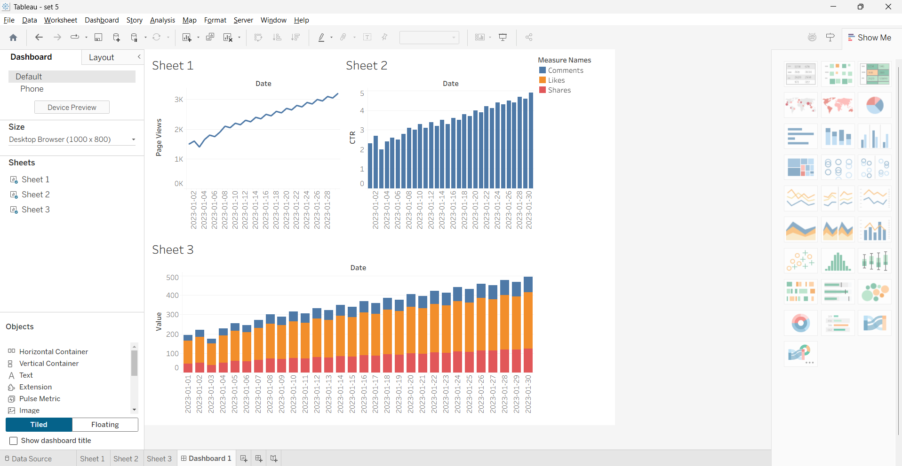
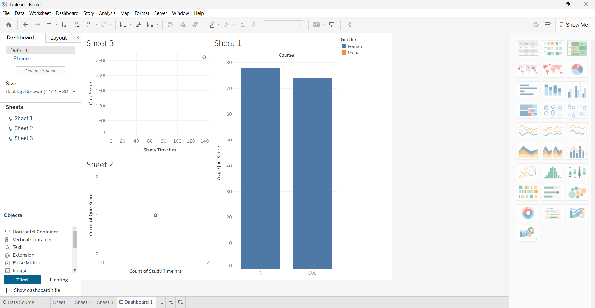
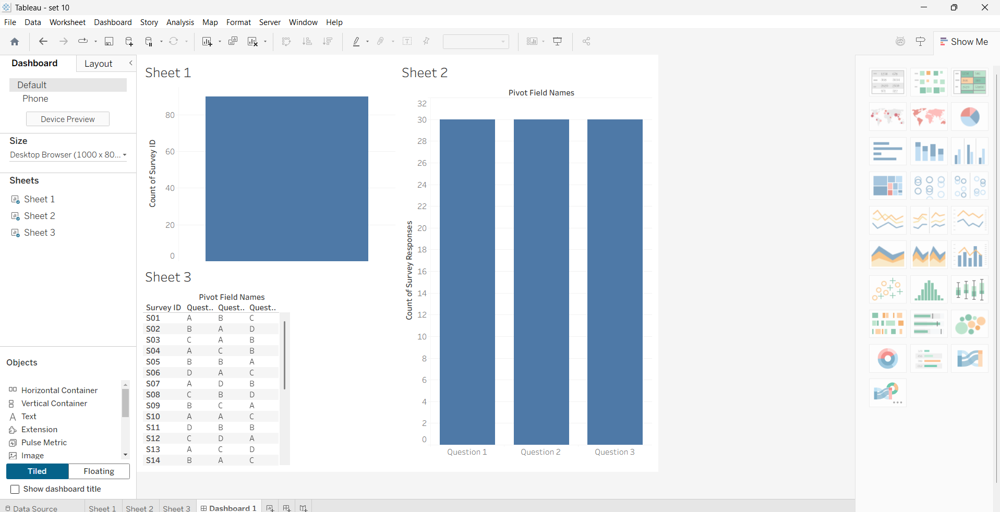
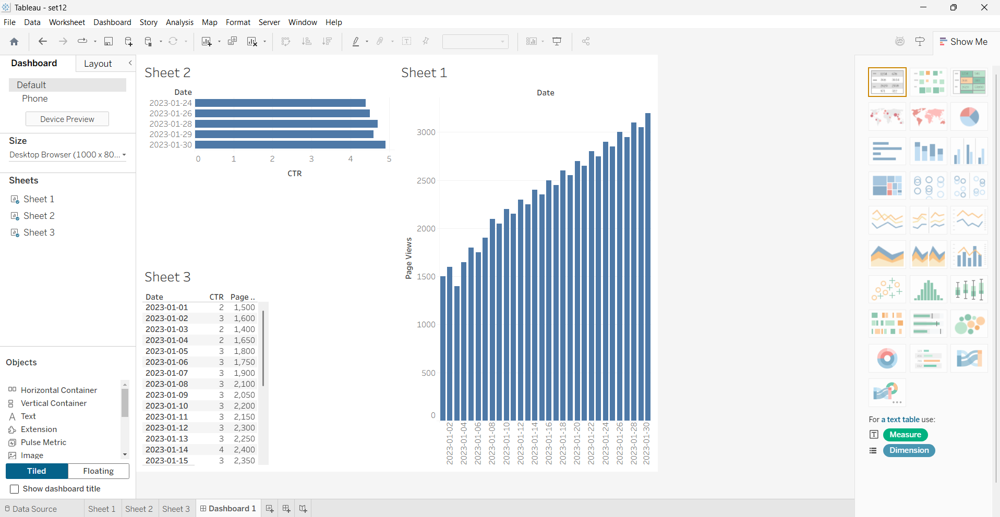

### Experiment 1: Budget vs Sales Analysis

**Aim:** To analyze the relationship between marketing budget allocation and actual sales generated, identifying the correlation and ROI.

**Procedure:**
1. Load Budget vs Sales dataset (Budget vs Sales.xlsx)
2. Clean and preprocess the data to remove any missing values
3. Calculate key metrics: total budget, total sales, and ROI percentage
4. Create visualizations to show budget allocation patterns
5. Generate correlation analysis between budget and sales
6. Identify high-performing and underperforming categories

**Output:**

---

### Experiment 2: Customer Demographics Analysis

**Aim:** To understand customer segments based on demographic factors like age, location, income, and purchasing patterns.

**Procedure:**
1. Load Customer Demographics dataset
2. Segment customers into demographic groups
3. Analyze purchasing patterns across demographics
4. Create demographic breakdown visualizations
5. Calculate average purchase value per demographic
6. Identify target customer segments

**Output:**

---

### Experiment 3: Product Sales Analysis

**Aim:** To analyze product performance across different categories and time periods to identify bestsellers and underperforming products.

**Procedure:**
1. Import Product Sales Analysis dataset
2. Calculate sales metrics: total sales, average price, quantity sold
3. Rank products by sales performance
4. Analyze category-wise performance
5. Create product performance heatmaps
6. Identify seasonal patterns in product sales

**Output:**

---

### Experiment 4: Product Inventory Analysis

**Aim:** To monitor inventory levels, identify stock imbalances, and optimize inventory management.

**Procedure:**
1. Load Product Inventory dataset
2. Analyze current stock levels across products
3. Calculate inventory turnover rates
4. Identify products with excess or insufficient stock
5. Create inventory status visualizations
6. Generate alerts for low stock items

**Output:**

---

### Experiment 5: Geographic Data Analysis

**Aim:** To analyze regional performance, geographic distribution of sales, and identify high-performing regions.

**Procedure:**
1. Import Geographic Data dataset
2. Map regional sales distribution
3. Calculate region-wise metrics and KPIs
4. Create choropleth maps for regional analysis
5. Identify growth opportunities in underperforming regions
6. Analyze geographic trends and patterns

**Output:**

---

### Experiment 6: Product Category Analysis

**Aim:** To understand product category performance, market share, and category-wise profitability.

**Procedure:**
1. Load Product Category dataset
2. Calculate category-wise sales and profit margins
3. Analyze category growth trends
4. Create category distribution pie charts
5. Compare category performance metrics
6. Generate category recommendations

**Output:**

---

### Experiment 7: Website Traffic Analysis

**Aim:** To analyze website visitor behavior, traffic sources, and conversion metrics.

**Procedure:**
1. Import Website Traffic datasets (both Set 12 and Dataset)
2. Analyze traffic sources and channels
3. Calculate bounce rates and session duration
4. Create traffic trend visualizations
5. Analyze visitor demographics from traffic data
6. Identify high-converting traffic sources

**Output:**

---

### Experiment 8: Employee Performance Analysis

**Aim:** To evaluate employee performance metrics, productivity levels, and identify top performers.

**Procedure:**
1. Load Employee Performance datasets
2. Calculate performance KPIs: productivity, quality, attendance
3. Rank employees by performance score
4. Create performance distribution visualizations
5. Analyze performance trends over time
6. Generate performance reports by department

**Output:**

---

### Experiment 9: Online Learning Activity Analysis

**Aim:** To analyze online learning engagement, course completion rates, and learner behavior patterns (using R for statistical analysis).

**Procedure:**
1. Load Online Learning Activity datasets
2. Analyze learner engagement metrics
3. Calculate course completion rates
4. Use R statistical analysis for deeper insights
5. Create engagement trend visualizations
6. Identify factors affecting learning outcomes

**Output:**

---

### Experiment 10: Survey Responses Analysis

**Aim:** To analyze survey responses, customer satisfaction levels, and feedback patterns.

**Procedure:**
1. Import Survey Responses dataset
2. Analyze response distributions and patterns
3. Calculate satisfaction metrics and NPS scores
4. Create sentiment analysis visualizations
5. Identify key themes in feedback
6. Generate actionable insights from survey data

**Output:**

---

### Experiment 11: Sales Performance Analysis

**Aim:** To evaluate overall sales performance, identify trends, and forecast future sales.

**Procedure:**
1. Load Monthly Sales Data
2. Calculate sales growth rates and trends
3. Analyze sales by product and region
4. Create trend line forecasts
5. Compare actual vs target sales
6. Generate sales performance reports

**Output:**

---

### Experiment 12: Monthly Product Sales Analysis

**Aim:** To analyze monthly product sales patterns, seasonality, and revenue trends.

**Procedure:**
1. Import Monthly Product Sales dataset
2. Calculate month-over-month growth rates
3. Analyze seasonal patterns in sales
4. Create time series visualizations
5. Identify peak and low sales periods
6. Generate revenue forecasting models

**Output:**

---

### Experiment 13: Geographic Sales Distribution

**Aim:** To visualize and analyze geographic distribution of sales across different regions and territories.

**Procedure:**
1. Load Geographic Data (Set 13)
2. Create regional sales maps
3. Calculate region-wise revenue and profit
4. Analyze geographic market penetration
5. Identify expansion opportunities
6. Create geographic performance dashboards

**Output:**

---

### Experiment 14: Survey Results Analysis

**Aim:** To comprehensively analyze survey results, identify patterns, and derive insights from collected data.

**Procedure:**
1. Import Survey Results (Set 14)
2. Perform descriptive statistics analysis
3. Create response distribution visualizations
4. Analyze correlation between survey questions
5. Segment responses by demographics
6. Generate survey insight reports

**Output:**

---

### Experiment 15: Customer Feedback Analysis

**Aim:** To analyze customer feedback, identify pain points, and extract actionable insights for improvement.

**Procedure:**
1. Load Customer Feedback Analysis dataset
2. Categorize feedback by type and sentiment
3. Analyze feedback frequency and trends
4. Create word clouds and text analysis visualizations
5. Identify common issues and concerns
6. Generate recommendations for improvement

**Output:**

---

### Experiment 16: Customer Demographics (Extended)

**Aim:** To deepen demographic segmentation and identify targeted marketing opportunities.

**Procedure:**
1. Load Customer Demographics Analysis dataset (Customer Demographics Analysis(16).xlsx)
2. Perform finer demographic binning and cohort analysis
3. Calculate lifetime value by segment
4. Visualize segment-wise purchase behavior
5. Recommend targeted campaigns

**Output:**

---

### Experiment 17: Employee Performance (Extended)

**Aim:** To analyze employee productivity and identify training needs.

**Procedure:**
1. Load Employee Performance dataset (Employee Performance Analysis(17).xlsx)
2. Compute performance KPIs and trend analysis
3. Identify departmental performance gaps
4. Visualize top/bottom performers and improvement areas
5. Suggest training/intervention strategies

**Output:**

---

### Experiment 18: Product Inventory Management

**Aim:** To optimize inventory levels and reduce stockouts.

**Procedure:**
1. Load Product Inventory datasets (Product Inventory Management(18).xlsx)
2. Calculate turnover, days-of-inventory, and reorder points
3. Identify slow-moving and fast-moving SKUs
4. Recommend inventory policies and safety stock
5. Visualize inventory heatmaps

**Output:**

---

### Experiment 19: Survey Responses Analysis (Extended)

**Aim:** To extract richer insights from extended survey data.

**Procedure:**
1. Load extended survey dataset (Survey Responses Analysis(19).xlsx)
2. Perform sentiment and thematic analysis
3. Cross-tabulate responses with demographics
4. Visualize key themes and satisfaction drivers
5. Present prioritized action items

**Output:**

---

### Experiment 20: Stock Analysis

**Aim:** To analyze stock performance and trading indicators for inventory valuation.

**Procedure:**
1. Load Stock Analysis datasets (Stock Analysis(20).xlsx)
2. Compute stock metrics and trend indicators
3. Visualize price/volume trends and moving averages
4. Assess inventory valuation impacts
5. Recommend inventory finance optimizations

**Output:**

---
### Experiment 21: Energy Consumption Analysis

**Aim:** To analyze energy usage patterns and identify opportunities for efficiency improvements.

**Procedure:**
1. Load Energy Consumption dataset (Energy Consumption Analysis(21).xlsx)
2. Clean and normalize consumption data across time
3. Compute peak/off-peak usage metrics and per-capita consumption
4. Visualize daily/weekly/monthly usage patterns
5. Identify inefficiencies and recommend energy-saving measures

**Output:**

---

### Experiment 22: Monthly Sales (Extended)

**Aim:** To extend monthly sales analysis with additional series and comparisons.

**Procedure:**
1. Load Monthly Sales Analysis datasets (Monthly Sales Analysis(22).xlsx, Monthly Sales Analysis(22.1).xlsx)
2. Aggregate monthly revenue and units sold
3. Perform trend decomposition and seasonality analysis
4. Visualize year-over-year and month-over-month changes
5. Forecast near-term sales using simple models

**Output:**

---

### Experiment 23: Employee Performance (Additional)

**Aim:** To further analyze employee KPIs and training impacts.

**Procedure:**
1. Load Employee Performance dataset (Employee Performance(23).xlsx)
2. Compute productivity, quality, and attendance metrics
3. Correlate training interventions with performance changes
4. Visualize department-wise comparisons and trends
5. Recommend targeted training programs

**Output:**

---

### Experiment 24: Product Inventory Analysis (Extended)

**Aim:** To optimize inventory turnover and stock allocation.

**Procedure:**
1. Load Product Inventory dataset (Product Inventory(24).xlsx)
2. Calculate turnover ratios, ABC classification, and days-of-inventory
3. Identify reorder points and safety stock levels
4. Visualize SKU performance and warehouse distribution
5. Recommend stocking policy changes

**Output:**

---

### Experiment 25: Website Traffic (Extended)

**Aim:** To deepen website traffic analysis and conversion insights.

**Procedure:**
1. Load Website Traffic dataset (Website Traffic(25).xlsx)
2. Analyze traffic sources, session duration, and bounce rates
3. Segment high-value visitor cohorts
4. Visualize funnel conversion and channel performance
5. Recommend optimizations to improve conversions

**Output:**

---

### Experiment 26: Student Mini Data Analysis

**Aim:** To analyze student performance and identify predictors of success.

**Procedure:**
1. Load Student Mini Data (Student Mini Data(26).xlsx)
2. Clean and preprocess academic and demographic variables
3. Compute performance distributions and correlations
4. Visualize top predictors of student success
5. Recommend interventions to improve outcomes

**Output:**

---

### Experiment 27: Patient Health Risk Analysis

**Aim:** To assess patient risk factors and predict health outcomes.

**Procedure:**
1. Load Patient Health Risk dataset (Patient Health Risk(27).xlsx)
2. Perform feature engineering on clinical variables
3. Compute risk scores and stratify patient groups
4. Visualize risk factor distributions and outcomes
5. Recommend targeted care pathways

**Output:**

---

### Experiment 28: Vehicle Performance Analysis

**Aim:** To analyze vehicle telemetry and identify performance issues.

**Procedure:**
1. Load Vehicle Performance dataset (Vehicle Performance(28).xlsx)
2. Clean time-series telemetry and compute summary metrics
3. Detect anomalies and failure indicators
4. Visualize performance by vehicle type and usage
5. Recommend maintenance schedules

**Output:**

---

### Experiment 29: Student Academic Performance Analysis (Extended)

**Aim:** To deeply analyze academic outcomes and identify improvement areas.

**Procedure:**
1. Load Student Academic Performance dataset (Student Academic Performance(29).xlsx)
2. Perform descriptive and predictive analyses
3. Visualize subject-wise performance trends
4. Identify at-risk students and success factors
5. Recommend curriculum or support changes

**Output:**

---

### Experiment 30: Mobile App Usage Analysis

**Aim:** To analyze mobile app engagement and retention metrics.

**Procedure:**
1. Load Mobile App Usage dataset (Mobile App Usage Analysis(30).xlsx)
2. Compute DAU/MAU, retention curves, and session metrics
3. Segment users by behavior and lifetime value
4. Visualize funnels and cohort retention
5. Recommend product improvements to boost engagement

**Output:**

---
